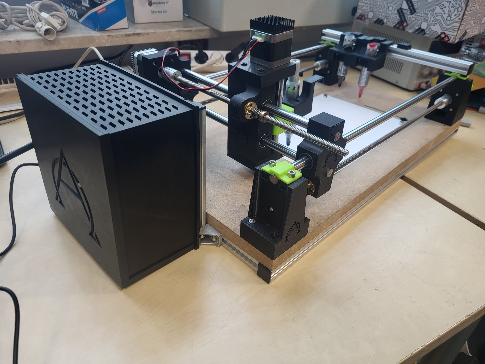
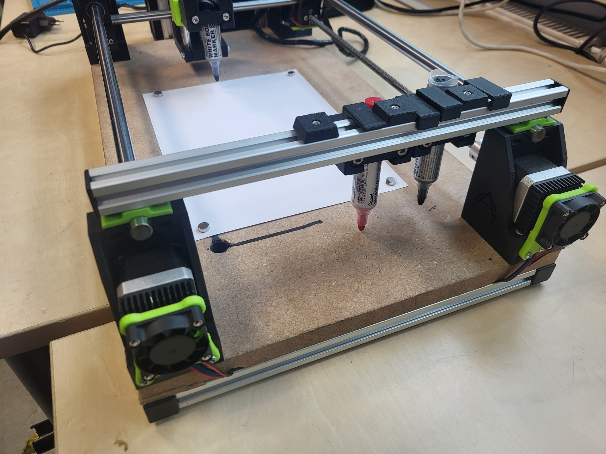
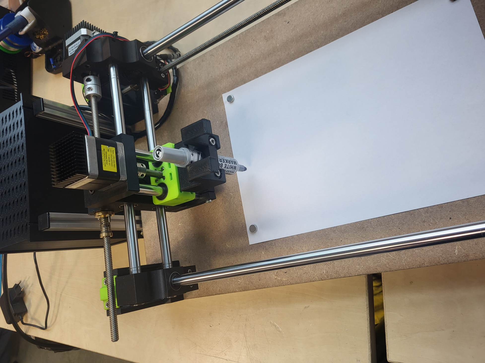
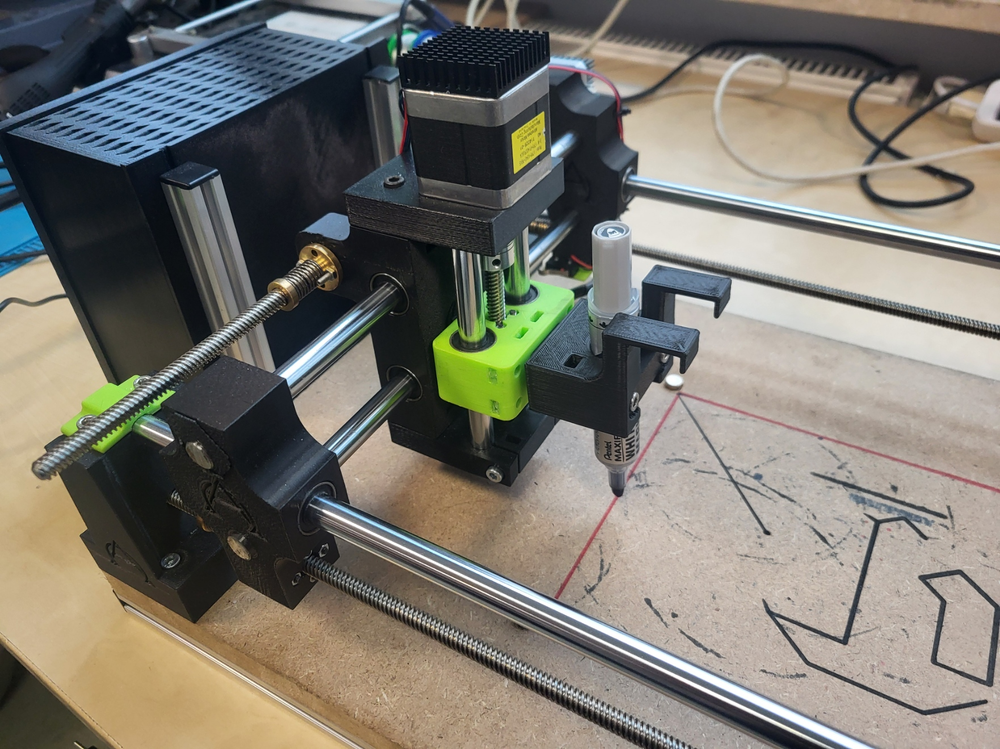
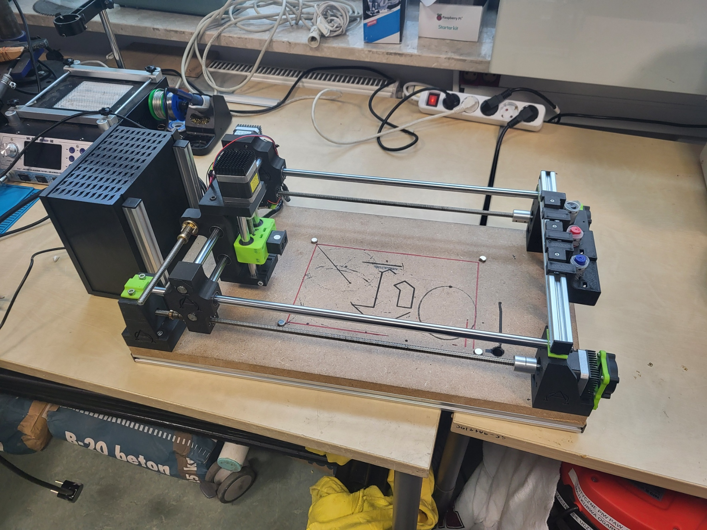

# Drawbot - drawing plotter #

## About the project ##

The Drawbot project is based on Raspberry Pi, Arduino and CNC Shield. Project uses (previously generated by user)  gcode to create beautiful drawings. This design allows user to easily change the tool,e.g. into multi-grinder to create your own PCBs.

 ## Hardware ##

- 3D printer :stuck_out_tongue:
- Raspberry Pi (4b)
- Arduino Uno with CNC Shield (with drivers)
- PSU for CNC Shield
- large amount of 
 - bolts
 - nuts
 - cables
- trapezoidal screws
- NEMA 17 motors
- linear rails (and bearings)
and I think that's all :smile:

## Software ##

- Mainsail (with Klipper)
- Gcode generator (I used [SVG_to_GCODE_generator](https://sameer.github.io/svg2gcode/) )

## Circuit Diagram ##

[Electrical Diagram](./Electrical_diagrams.pdf)

## Pictures of Drawbot ##







# Software installation #

## Install Mainsail (use [Mainsail instalation guide](https://docs.mainsail.xyz/setup/getting-started) ) ##

## Configure Klipper ( [Klipper instalation guide](https://www.klipper3d.org/Installation.html) ) ##

***menuconfig configuration***
```
Enable extra low level configuration options
MCU Architecture: Atmega AVR
Processor model: atmega328p
Processor speed: 16 MHz
Baud rate for serial port: 250000 
```
Additionally, before running`make` you might have to go `nano .config`
and set the following:
```
CONFIG_WANT_DISPLAYS=n
CONFIG_WANT_SENSORS=n
CONFIG_WANT_LIS2DW=n
CONFIG_WANT_SOFTWARE_I2C=n
CONFIG_WANT_SOFTWARE_SPI=n
CONFIG_CANBUS_FREQUENCY=1000000
CONFIG_HAVE_GPIO=y
CONFIG_HAVE_GPIO_ADC=n
CONFIG_HAVE_GPIO_SPI=n
CONFIG_HAVE_GPIO_I2C=n
```
## Device configuration ##

Download from repository `printer.cfg` file and paste it in Machine section in your Mainsail site.
You probably have to change some parameters based on your construction (e.g. based on trapezoidal screws and microsteps set on the CNC Shield).
